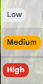
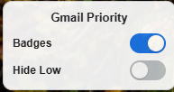

# Gmail Priority Classifier

A privacy-conscious Chrome extension that labels your Gmail inbox by priority.
Each visible email row is tagged **High**, **Medium**, or **Low** by a neural
network that runs locally on your own machine — no email text is ever sent to a
third-party service.

The extension reads the text already rendered in your inbox, sends it to a local
**FastAPI** backend, and draws a colored badge from the model's prediction. You
can correct any label with a click; corrections are logged locally and folded
back into the model with a one-command retraining pipeline that also produces
versioned evaluation reports.

---

## Demo

> Screenshots live in [`screenshots/`](screenshots/). Replace the placeholders
> below with your own captures.

| Priority badges in the inbox | Control panel |
| --- | --- |
|  |  |

| Correction menu | Backend model status |
| --- | --- |
|  |  |


---

## Features

- **Local neural-network classification** — sentence-transformer embeddings + a
  PyTorch classifier predict High / Medium / Low with a confidence score.
- **Reads meaning, not just keywords** — e.g. *"Special offer: save big this
  weekend"* is correctly **Low** (promotional) even though "offer" would trip a
  naive keyword rule.
- **Priority badges** injected into each Gmail inbox row.
- **Two pill toggles** — *Badges* (show/hide badges) and *Hide Low* (collapse
  low-priority rows), both persisted across refreshes.
- **One-click label correction** — a dropdown on each badge lets you fix the
  label; the change applies instantly and respects *Hide Low*.
- **Local feedback loop** — corrections are appended to `feedback.csv` on your
  machine.
- **Retraining pipeline** — fold your corrections back into the model with a
  single command.
- **Persistent evaluation reports** — every retrain writes TXT + JSON metrics
  and a confusion-matrix PNG.
- **Graceful fallbacks** — neural network → backend rule-based scoring → in-page
  JavaScript rules, so you always get badges.

---

## Architecture

```
                         SCORING FLOW
  ┌─────────┐   row text   ┌──────────────────┐   POST /score   ┌─────────────────┐
  │  Gmail  │ ───────────► │ Chrome Extension │ ──────────────► │ FastAPI Backend │
  │  inbox  │              │  (content.js)    │                 │   (main.py)     │
  └─────────┘              └──────────────────┘                 └────────┬────────┘
       ▲                          │                                      │
       │   High / Medium / Low    │                          ┌──────────▼───────────┐
       │   badge rendered         │                          │  Neural Network      │
       └──────────────────────────┘                          │  (PyTorch + MiniLM)  │
                                                              │      ── or ──        │
                                                              │  Rule-based fallback │
                                                              └──────────────────────┘

                         FEEDBACK / RETRAINING LOOP
  ┌──────────────────┐  POST /feedback  ┌──────────────┐   reads   ┌─────────────────────────┐
  │ User corrections │ ───────────────► │ feedback.csv │ ────────► │ retrain_with_feedback.py│
  │  (badge clicks)  │                  │  (local)     │           └────────────┬────────────┘
  └──────────────────┘                  └──────────────┘                        │
                                                                                 ▼
                                                              ┌─────────────────────────────┐
                                                              │  updated model/ + reports/  │
                                                              └─────────────────────────────┘
```

Scoring is independent of badge visibility: rows are always scored and tagged so
*Hide Low* keeps working even when badges are off. If the backend is unreachable,
the extension falls back to the same keyword rules running in JavaScript.

---

## Tech stack

| Layer | Technology |
| --- | --- |
| Extension | Chrome Manifest V3, vanilla JavaScript, CSS (no frameworks/build step) |
| Backend | Python, FastAPI, Uvicorn, Pydantic |
| ML | PyTorch, sentence-transformers (`all-MiniLM-L6-v2`, 384-dim), scikit-learn |
| Reports | scikit-learn metrics, matplotlib (optional) |
| Storage | Local CSV files (`feedback.csv`), local model artifacts |

---

## How it works

1. **Extraction** — `content.js` reads each inbox row's visible text and
   normalizes it (collapses whitespace, lowercases, skips its own badge).
2. **Scoring** — it `POST`s the text to `http://127.0.0.1:8000/score`. The
   backend embeds the text with `all-MiniLM-L6-v2` and runs `PriorityNet`
   (`Linear → ReLU → Dropout → Linear`), returning a label and confidence.
3. **Rendering** — the extension draws a High/Medium/Low badge and tags the row
   so the *Hide Low* CSS rule can act on it.
4. **Correction** — clicking a badge opens a High/Medium/Low menu. The choice
   updates the UI immediately and is `POST`ed to `/feedback`.
5. **Learning** — `retrain_with_feedback.py` merges your corrections with the
   starter dataset, retrains the model, and writes evaluation reports.

Resilience is built in with two fallback layers: if the model can't load the
backend uses rule-based keyword scoring, and if the backend is offline entirely
the extension uses the same rules in JavaScript.

---

## Setup

Clone the repo and install the backend dependencies.

```bash
cd backend
pip install -r requirements.txt
```

> On Windows, if `pip`/`python` resolve to the Microsoft Store stub, use the `py`
> launcher: `py -m pip install -r requirements.txt`. The first install is large
> (PyTorch + sentence-transformers), and the first run downloads the embedding
> model (`all-MiniLM-L6-v2`, ~90 MB) once.
>
> `matplotlib` is optional and only needed for the confusion-matrix image:
> `pip install matplotlib`.

### Running the backend

```bash
cd backend
py train_nn.py                      # train the model (first time / when data changes)
py -m uvicorn main:app --reload     # start the server at http://127.0.0.1:8000
```

Confirm it's healthy and check which engine is active:

- Health: <http://127.0.0.1:8000/health> → `{"status":"ok"}`
- Model status: <http://127.0.0.1:8000/model-status> → reports `neural-network`
  or `rule-based`
- Interactive docs: <http://127.0.0.1:8000/docs>

### Loading the Chrome extension

1. Open `chrome://extensions`.
2. Enable **Developer mode** (top-right).
3. Click **Load unpacked** and select the `gmail-priority-extension/` folder.
4. Open or refresh <https://mail.google.com>. Badges appear on your inbox rows.

> After editing extension files, click the **reload** (↻) icon on the extension
> card in `chrome://extensions`, then refresh Gmail.

### Training the neural network

`train_nn.py` trains from the starter dataset (`email_training_data.csv`, a
`text,label` pair per row with labels High/Medium/Low). It builds embeddings,
trains `PriorityNet`, prints training accuracy, and saves
`model/priority_model.pt` and `model/label_map.json`.

```bash
cd backend
py train_nn.py
```

Add more real labeled rows to `email_training_data.csv` and re-run to improve
accuracy. (Training is optional — the backend falls back to rule-based scoring
until a model exists.)

### Collecting feedback

While using Gmail, click any badge and choose the correct label from the
dropdown (the current label is check-marked). Each correction:

- updates the badge immediately and re-applies *Hide Low*, and
- is `POST`ed to `/feedback`, which appends a row to `backend/feedback.csv`:

  ```
  timestamp,text,predictedLabel,correctedLabel,confidence
  ```

If the backend is offline the badge still updates locally; only the CSV write is
skipped (with a console warning).

### Retraining from feedback

When you've gathered some corrections, retrain so the model learns from them:

```bash
cd backend
py retrain_with_feedback.py
py -m uvicorn main:app --reload     # restart so the backend loads the new model
```

`retrain_with_feedback.py` loads `email_training_data.csv` plus `feedback.csv`
(using each correction's `text` and `correctedLabel`; `predictedLabel` is ignored
for training), combines them into one `text,label` dataset, drops blanks and
invalid labels, removes duplicates, and reports how many base vs. feedback
examples were used. It reuses the exact architecture and embedding model from
`train_nn.py` and overwrites the same `model/` files the backend reads. With ≥30
combined examples it uses an 80/20 train/test split and reports test metrics;
with fewer it trains on all data and reports training accuracy only.

`train_nn.py` is left intact as the clean starter trainer; use
`retrain_with_feedback.py` to incorporate feedback.

### Evaluation reports

Every retraining run writes a persistent report to `backend/reports/`:

- **`evaluation_report.txt`** — timestamp, dataset sizes, class distribution,
  train/test accuracy, confusion matrix, and classification report.
- **`evaluation_report.json`** — the same metrics in machine-readable form.
- **`confusion_matrix.png`** — rendered confusion matrix (only if `matplotlib`
  is installed; otherwise skipped gracefully).

The reports contain only aggregate metrics — no email text.

---

## Privacy and security

This project is **local-first by design**:

- Email text is processed **only** through *your own* FastAPI backend running on
  `127.0.0.1`. It is **never** sent to any third-party or cloud API.
- The embedding model runs locally; classification happens on your machine.
- `feedback.csv` (which contains real email text) and the generated `reports/`
  and `model/` folders are **gitignored**, so personal data is never committed.
- The extension only reads text already rendered on the Gmail page (the DOM). It
  does not use the Gmail API, does not change your real Gmail labels, and does
  not move or delete mail.

---

## Limitations

- **Tiny starter dataset** (~66 examples), so out-of-the-box accuracy is modest;
  it improves as you add data and feedback.
- **Gmail's DOM is unofficial.** The row selector (`tr.zA`) can break when Google
  changes its markup; see `gmail-priority-extension/README.md` for where to fix
  it.
- **Visual only.** Badges and hiding are cosmetic overlays; real Gmail labels are
  untouched.
- **Backend must be running** for neural scoring; otherwise the extension uses
  rule-based fallbacks.

---

## Future improvements

- Train on a larger, more realistic labeled dataset.
- Use the Gmail API / OAuth for structured access instead of scraping the DOM.
- Apply real Gmail labels instead of visual-only badges.
- On-device inference in the browser (e.g. ONNX Runtime Web) to remove the
  backend entirely.
- Track evaluation metrics over time from the JSON reports.

---

## Resume bullet

> Built a privacy-conscious Gmail prioritization Chrome extension with a FastAPI
> inference backend, PyTorch neural network classifier, local feedback
> collection, retraining pipeline, and dynamic inbox UI controls.

---

## Project structure

```
EmailClassifier/
  gmail-priority-extension/   Chrome extension (Manifest V3, plain JS/CSS)
  backend/                    FastAPI service + PyTorch model and trainers
    main.py                   /score, /feedback, /health, /model-status
    train_nn.py               trains the model from the starter CSV
    retrain_with_feedback.py  retrains on starter CSV + feedback.csv, writes reports
    email_training_data.csv   starter labeled examples
    feedback.csv              user label corrections (gitignored)
    model/                    generated model artifacts (gitignored)
    reports/                  evaluation reports from retraining (gitignored)
  screenshots/                images referenced by this README
```

Detailed backend and extension docs, including all API endpoints and notes on
Gmail's unstable DOM, are in
[`gmail-priority-extension/README.md`](gmail-priority-extension/README.md).

---

*This is a personal learning project, not an official Google product.*
